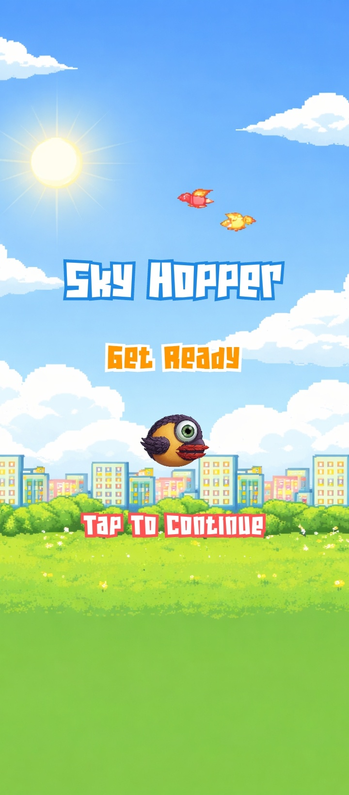
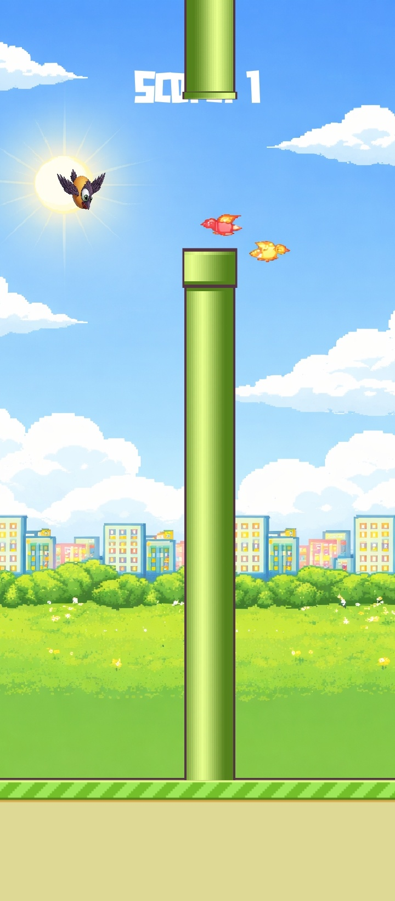
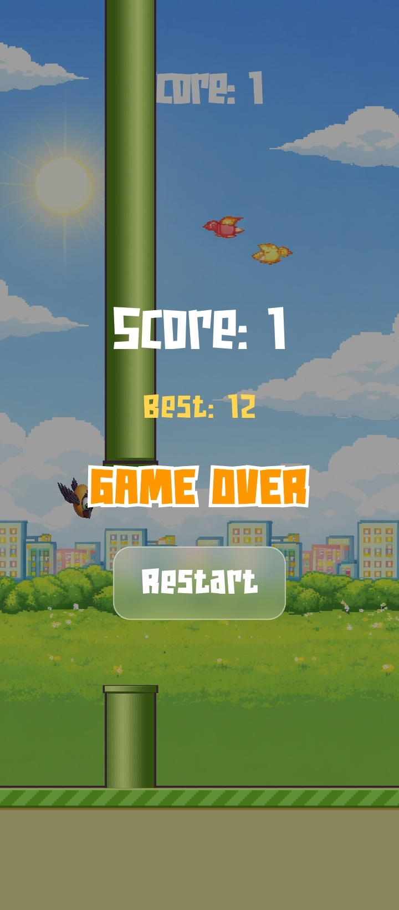

# 🐦 Sky Hopper – Flutter Flame Game

A simple 2D arcade game built with Flutter using the Flame game engine.
The player controls a bird that must fly through pipes without colliding. Each successful pass increases the score. The goal is to achieve the highest score possible.

This project demonstrates game development using Flutter, including physics, collision detection, animations, and score management.

## 🎮 Gameplay

* Tap the screen to make the bird jump

* Avoid hitting the pipes

* Score increases when you successfully pass obstacles

* Game ends when the bird collides with a pipe or the ground

* Restart option available after game over

## 📸 Screenshots

## 🚀 Features

* Built using Flutter

* Powered by Flame Game Engine

* Smooth sprite animations

* Collision detection

* Score tracking

* Best score storage

* Game restart functionality

* Lightweight and optimized

## 🛠️ Tech Stack

* Flutter

* Flame Engine

* Dart
